<!-- ================= HERO BANNER ================= -->

<p align="center">
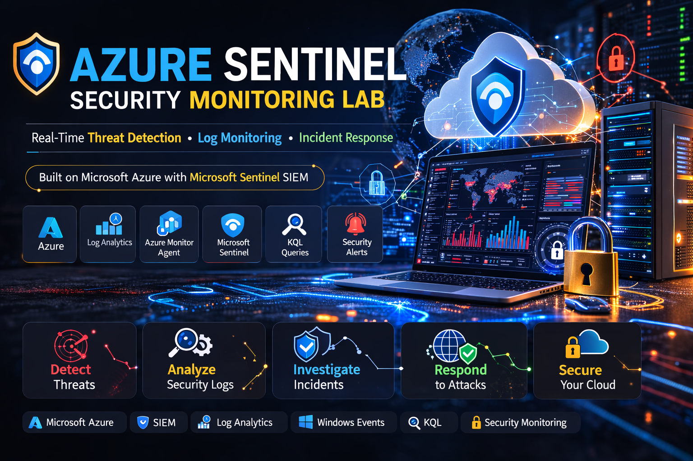
</p>

<h1 align="center">🛡️ Azure Sentinel Security Monitoring Lab</h1>

<p align="center">
A hands-on <b>Cybersecurity Lab</b> demonstrating how to build a <b>Security Monitoring Environment</b> using <b>Microsoft Sentinel (SIEM)</b> in Microsoft Azure.
</p>

<p align="center">


</p>

---

## 🧩 Sentinel Security Monitoring Architecture

<p align="center">
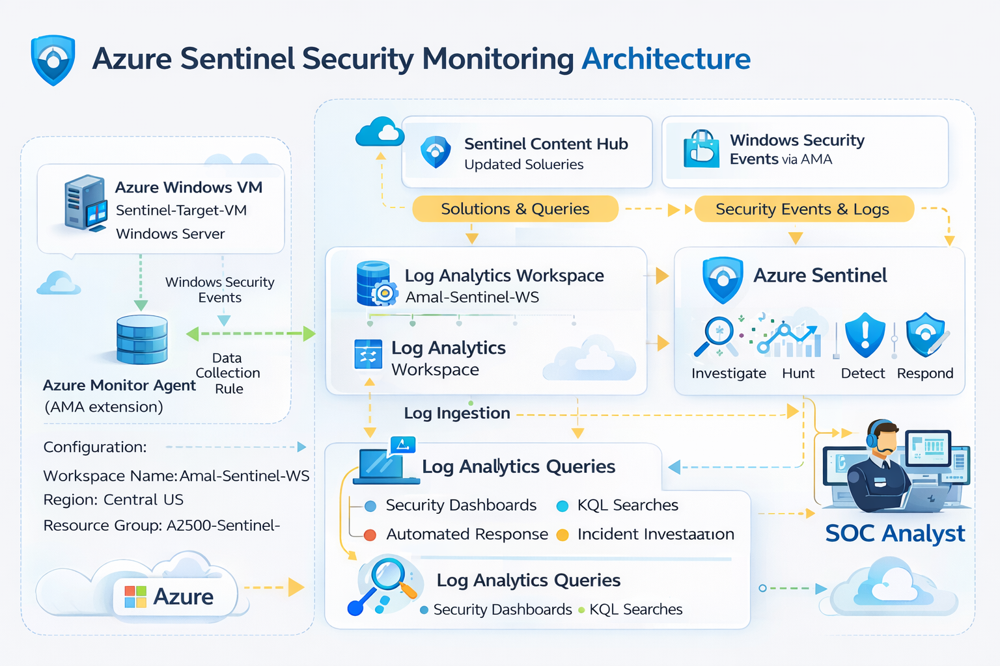
</p>

---

# 📌 Overview

This lab demonstrates how security analysts can detect authentication attacks, investigate suspicious activities, and perform threat hunting using Microsoft Sentinel.

This project demonstrates how to build a **Security Monitoring Lab using Microsoft Sentinel in Microsoft Azure**.

The lab simulates a **real-world Security Operations Center (SOC) environment** where logs are collected from a Windows server and analyzed using Microsoft Sentinel.

The lab includes:

- Deploying a **Windows Server Virtual Machine**
- Creating a **Log Analytics Workspace**
- Enabling **Microsoft Sentinel**
- Installing **Azure Monitor Agent (AMA)**
- Configuring **Windows Security Events Connector**
- Creating **Data Collection Rules (DCR)**
- Monitoring **Security Logs with KQL queries**

---

# 🏗️ Lab Architecture

This project simulates a **SOC monitoring pipeline in Microsoft Azure**.

Logs generated from a **Windows Virtual Machine** are collected using the **Azure Monitor Agent (AMA)** and sent to **Log Analytics Workspace**, where **Microsoft Sentinel** performs security analysis and threat detection.

---

## 🔗 Security Data Flow


<p align="center">
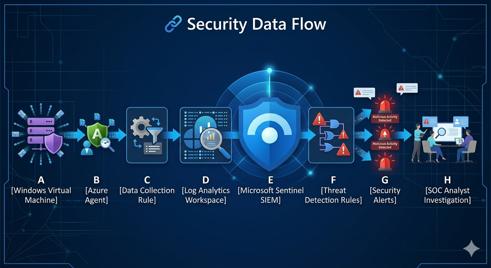
</p>

---

# ⚙️ Security Monitoring Pipeline

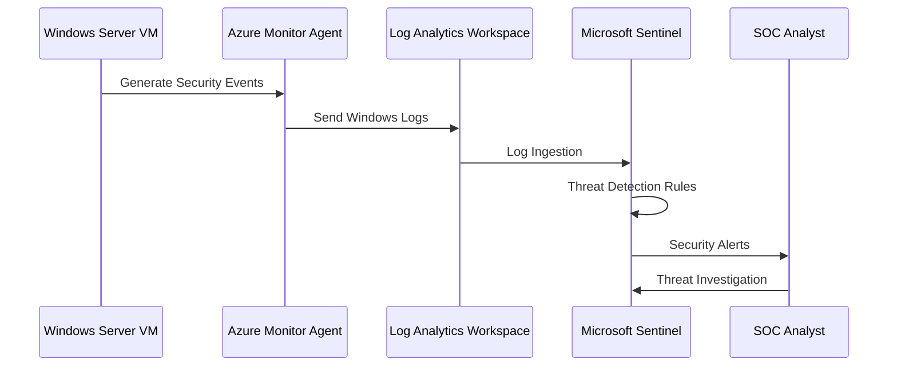

---

# ⚙️ Lab Deployment Steps

---

# 1️⃣ Create Log Analytics Workspace

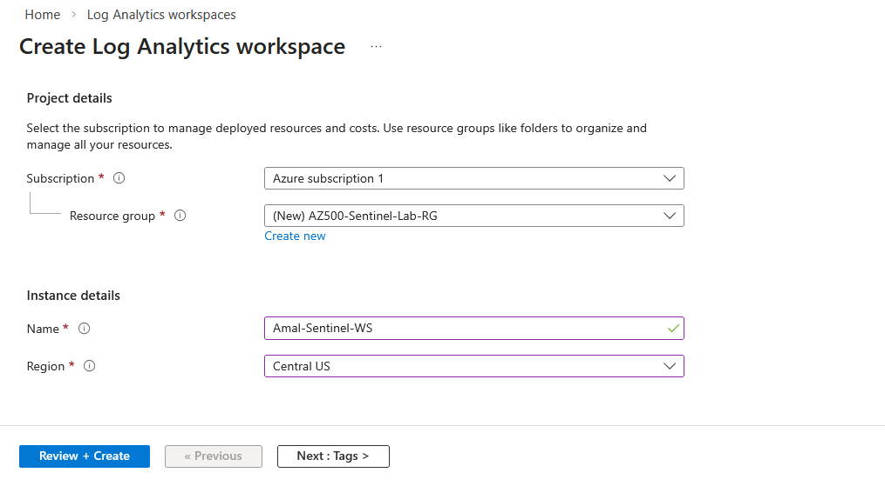

A **Log Analytics Workspace** is created to store and analyze logs collected from Azure resources.

Configuration:

Workspace Name: `Amal-Sentinel-WS`  
Region: `Central US`  
Resource Group: `AZ500-Sentinel-Lab-RG`

This workspace acts as the **central logging repository for Microsoft Sentinel**.

---

# 2️⃣ Enable Microsoft Sentinel

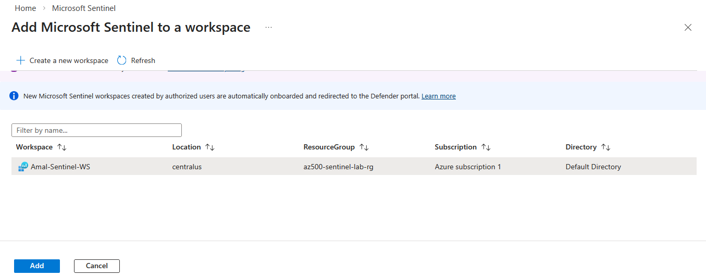

Microsoft Sentinel is enabled on the created Log Analytics Workspace.

Sentinel is a **cloud-native SIEM (Security Information and Event Management) and SOAR platform** used for security monitoring and threat detection.

---

# 3️⃣ Deploy Target Virtual Machine

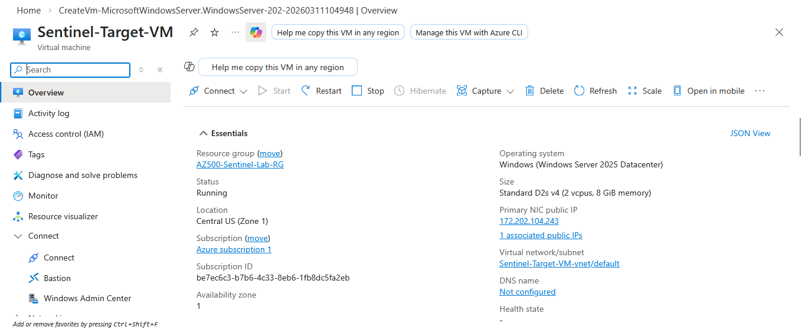

A **Windows Server Virtual Machine** is deployed to simulate endpoint activity.

Configuration:

VM Name: `Sentinel-Target-VM`  
Operating System: Windows Server  
VM Size: Standard D2s v4  
Public IP: Enabled

This machine will generate **Windows Security Events for monitoring**.

---

# 4️⃣ Install Azure Monitor Agent

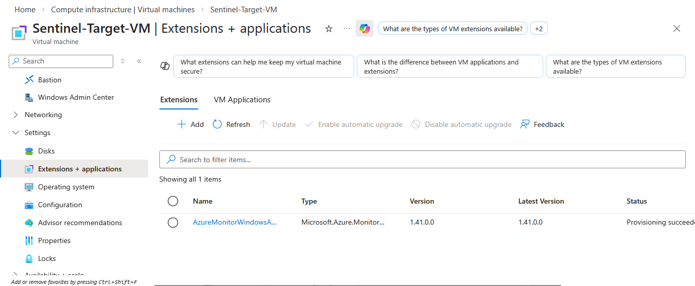

The **Azure Monitor Agent (AMA)** is installed on the virtual machine using VM Extensions.

This agent sends logs to **Azure Monitor and Microsoft Sentinel**.

---

# 5️⃣ Install Windows Security Events Solution

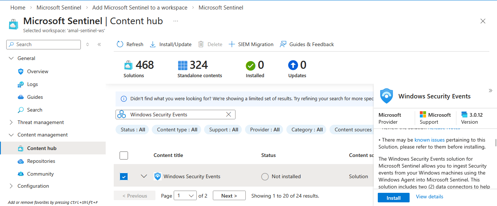

The **Windows Security Events Solution** is installed from the **Microsoft Sentinel Content Hub**.

This enables the collection of important Windows security logs including:

- Login attempts  
- Account activity  
- Authentication logs  
- Security audit logs  

---

# 6️⃣ Configure Windows Security Events Connector

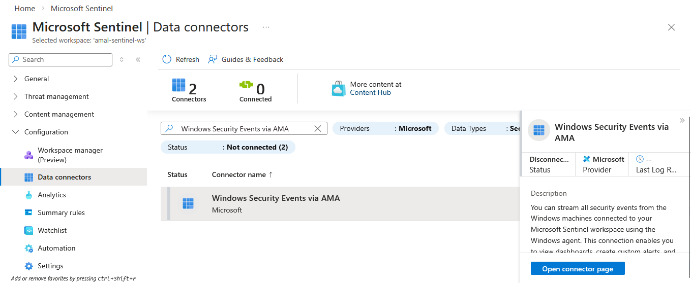

The **Windows Security Events via AMA** data connector is configured.

This connector allows Windows machines to securely stream **Security Event Logs directly to Microsoft Sentinel**.

---

# 7️⃣ Create Data Collection Rule

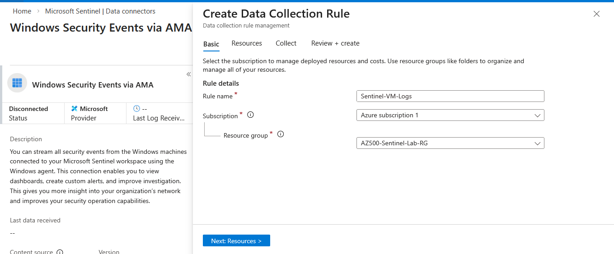

A **Data Collection Rule (DCR)** defines what data should be collected from connected machines.

Configuration:

Rule Name: `Sentinel-VM-Logs`  
Target Machine: `Sentinel-Target-VM`  
Event Collection: `All Security Events`

---

# 8️⃣ Assign Data Collection Rule to VM

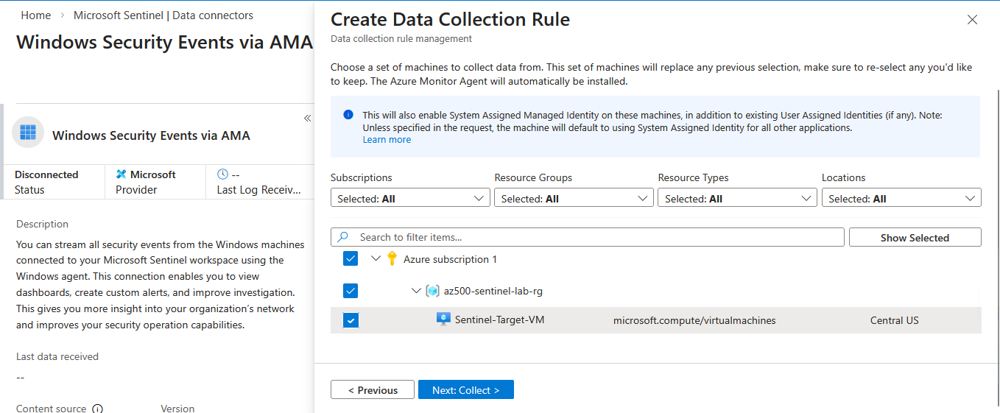

The target VM is assigned to the created Data Collection Rule.

This allows the VM to start **sending Windows Security Events to Microsoft Sentinel**.

---

# 📊 Security Log Monitoring

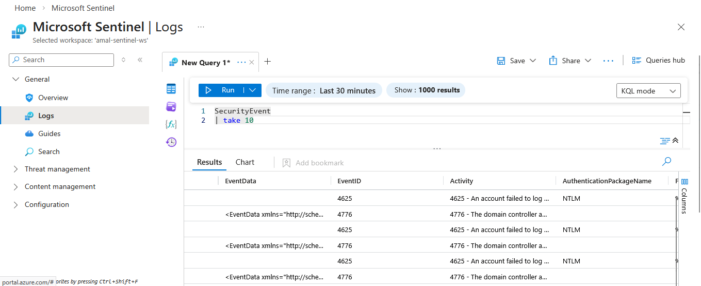

Once logs start arriving, they can be analyzed using **Kusto Query Language (KQL)**.

Example query to detect failed login attempts:

```kql
SecurityEvent
| where EventID == 4625
| project TimeGenerated, Computer, Account, IpAddress, EventID
```

Event ID **4625** represents **failed authentication attempts**.

---

# 🔎 Example Threat Detection

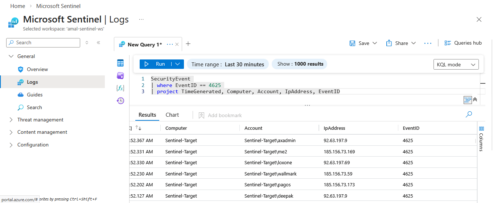

Security analysts can identify:

- Suspicious IP addresses  
- Repeated login failures  
- Possible brute force attacks  
- Unauthorized access attempts  

---

# 📈 Microsoft Sentinel Monitoring Dashboard

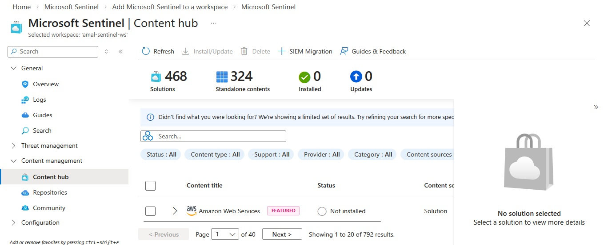

Microsoft Sentinel provides centralized capabilities for:

- Log analysis  
- Threat hunting  
- Security investigation  
- Alert creation  
- Incident response  

---

# 🎯 Security Monitoring Capabilities

✔ Failed Login Detection (Event ID 4625)  
✔ Brute Force Attack Identification  
✔ Suspicious Authentication Monitoring  
✔ Threat Hunting using KQL  
✔ Centralized Log Analysis with Microsoft Sentinel
---

# 🧠 Technologies Used


- Microsoft Azure
- Microsoft Sentinel
- Azure Monitor Agent
- Log Analytics Workspace
- Kusto Query Language (KQL)
- Windows Security Events
---

# 📁 Repository Structure

```
Azure-Sentinel-Security-Lab
│
├── README.md
│
├── images
│   ├── Log-Analytics.png
│   ├── add-Microsoft-Sentinel.png
│   ├── create-VM.png
│   ├── Sentinel-Target-VM-Extensions+applications.png
│   ├── Windows-Security-Events-install.png
│   ├── MSDC.png
│   ├── create-data-connection-rule.png
│   ├── set-VM-MSDC.png
│   ├── logs.png
│   ├── 4625-logs.png
│   └── dashboard.png
│
└── architecture
    └── sentinel-architecture.png
```

---

# 👨‍💻 Author

**Amal Udayanga Basnayake**

Cybersecurity Enthusiast  

Cloud Security • SIEM • Threat Detection • Microsoft Sentinel • Azure Security

GitHub  
https://github.com/AmalUBasnayake  

Linkedln

https://www.linkedin.com/in/amal-udayanga-basnayake

Medium 

https://medium.com/@amalubasnayake/️-building-a-siem-threat-detection-lab-using-microsoft-sentinel-in-azure-2303339c6353

---

⭐ If you found this project useful, consider giving the repository a **star**.
